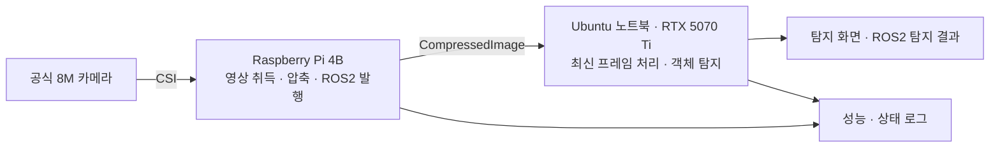

# ROS2 Edge Vision

**ROS2 기반 분산 비전 시스템 구축 및 지연·장애 복구 개선**

라즈베리파이에서 카메라 영상을 취득·압축해 ROS2로 전송하고, 노트북 GPU에서 객체를 탐지하는 개인 프로젝트입니다. 영상 처리 지연과 연결 장애를 측정하고, 실험 결과를 근거로 시스템을 개선합니다.

> **현재 상태: 기획 완료 · 환경 구축 전**<br>
> 아래 구조와 일정은 구현 계획입니다. 실행 가능한 ROS 패키지, 시연 영상, 실측 성능은 개발하면서 추가합니다.

[상세 프로젝트 계획](docs/project-plan.md) · [진행 체크리스트 및 작업 기록](docs/progress.md)

## 목표

- 실제 카메라·라즈베리파이·노트북을 연결하는 ROS2 비전 파이프라인 구현
- 영상 수신과 추론을 분리하고 최신 프레임을 처리해 대기열 누적 방지
- 통신·압축 설정에 따른 지연, 처리량, 자원 사용량 비교
- 입력 중단과 네트워크 단절 후 복구 동작 검증
- 다른 사람이 따라 실행할 수 있는 설정·측정 방법·문서 제공

## 시스템 구성



Pi는 카메라 제어와 영상 전송을 맡고, 노트북은 GPU 추론·시각화·실험 자료 저장을 맡습니다. 초기 카메라 호환성 검증이 지연되면 Galaxy S22의 영상 스트림을 Pi가 받아 ROS2로 변환하는 대안을 사용합니다. 최종 입력 방식은 초기 검증 후 하나로 고정합니다.

## 장비와 개발 환경

| 구분 | 장비·환경 | 상태 |
|---|---|---|
| 카메라 | 공식 8M 카메라 | 실제 센서 모델·구동 확인 예정 |
| 영상 취득·전송 | Raspberry Pi 4B · RAM 4GB · SD 32GB | OS 새 설치 예정 |
| 영상 처리 | Intel Core Ultra 9 · NVIDIA RTX 5070 Ti 노트북 | CUDA·모델 추론 확인 예정 |
| 노트북 OS | Ubuntu 24.04 · Windows 듀얼부팅 | 개발은 기존 Ubuntu 사용 |
| ROS2 | Jazzy | 설치·장비 간 통신 확인 예정 |
| 보조 장비 | Galaxy S22 | 시연 촬영 또는 대체 입력 |

Pi의 기본 OS 후보는 Ubuntu Server 24.04 64비트입니다. CSI 카메라는 추가 libcamera 설정·빌드가 필요할 수 있어 첫 이틀에 검증합니다. GPU 환경은 실제 CUDA 연산과 모델 추론을 확인한 뒤 버전을 고정합니다. 세부 호환성 근거와 대안은 [계획서](docs/project-plan.md)에 기록했습니다.

## 구현 범위

| 구성 | 구현할 기능 |
|---|---|
| 영상 입력·발행 | 기존 카메라 드라이버 활용, 압축, 발행 FPS 조절, ROS2 전송 |
| 객체 탐지 | 사전학습 경량 YOLO 모델, 수신·추론 분리, 최신 프레임 유지 |
| 결과 활용 | 화면 표시, `vision_msgs/msg/Detection2DArray` 발행 |
| 상태·복구 | 입력 중단 감지, 재시도, 복구 후 오래된 프레임 폐기 |
| 계측·재현 | CSV 로그, 설정 파일, 비교 그래프, 장비별 실행 절차 |

첫 버전은 단일 카메라·단일 입력·단일 탐지 모델을 대상으로 합니다. 모델 학습, 객체 추적, 다중 카메라, 웹 대시보드는 후속 확장 후보입니다.

## 3주 일정

하루 3~4시간, 약 15작업일을 기준으로 합니다. 환경 문제와 면접 일정에 따라 작업일을 조정합니다.

| 작업일 | 단계 | 산출물 |
|---|---|---|
| 1~2일차 | 카메라·ROS 통신·GPU 환경 검증 | 입력 방식 결정, 환경 기록 |
| 3~5일차 | 영상 전송과 탐지 연결 | 첫 작동 데모 |
| 6~8일차 | 최신 프레임 처리·복구·계측 | 상태 로그, 성능 CSV |
| 9~11일차 | 설정 비교·과부하·단절 시험 | 비교 그래프, 시험 결과 |
| 12~15일차 | 재현 확인·문서·영상 정리 | README, 1분 시연 영상, 첫 릴리스 |

진척 상태는 [진행 체크리스트](docs/progress.md)에서 관리합니다.

## 검증 기준

- 선정한 설정에서 **10분 연속 실행**하고 처리량·자원·오류 기록 확보
- 입력 공급과 Pi 네트워크를 각각 중단·복구하며 새 영상 처리 확인
- 추론을 느리게 해도 대기 프레임이 최대 1장으로 유지되는지 검증
- QoS와 JPEG 품질을 바꾸어 동일 조건에서 반복 측정
- 실행 절차, 실제 측정 결과, 한계, 시연 영상 정리

위 항목은 앞으로 확인할 기준입니다. 현재 측정한 성능 수치는 없습니다. FPS·평균/p95 지연·영상 데이터량·CPU 사용량을 기록하며, 촬영부터 최종 표시까지의 지연과 장비 내부 처리시간을 구분합니다.

## 저장소 구성

```text
git_ws/
├── README.md
├── .gitignore
└── docs/
    ├── project-plan.md
    └── progress.md
```

구현을 시작하면 ROS2 패키지와 설정·분석 도구를 추가합니다. 환경 구성 기록, 문제 해결 과정, 실험 원본과 결과를 의미 있는 변경 단위로 커밋합니다.

## 시작 상태

현재는 계획과 진행 기록을 준비한 단계입니다. 첫 작업은 Pi 카메라 프레임 취득, Pi↔노트북 ROS2 통신, 노트북 GPU 추론 환경을 각각 확인하는 것입니다. 검증된 설치·실행 명령은 해당 단계가 완료되면 추가합니다.
