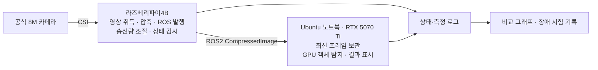

# ROS2 기반 분산 비전 파이프라인 구축 및 지연·장애 복구 개선

작성일: 2026-09-22 · 계획 v1.0 · 상태: 기획 완료, 환경 구축 전

## 1. 프로젝트 목표

공식 8M 카메라, 라즈베리파이4B, 노트북을 연결해 객체 탐지 시스템을 만들고, 영상 지연과 연결 장애의 원인을 측정하여 개선한다. ROS2 로봇 소프트웨어 직무를 위한 개인 포트폴리오를 우선 가정한다. 시연 장면은 책상 위 물체나 사람을 탐지하는 소규모 비전 센서로 정한다.

설명할 핵심 역량은 분산 노드 구성, 센서 데이터 처리, 비동기 처리, 설정 선택의 근거, 장애 복구, 재현 가능한 실험이다. 사전학습 모델을 사용하므로 자체 AI 모델 개발이나 정확도 개선을 성과로 주장하지 않는다.

첫 버전 완료 시점에 이력서에 연결할 수 있는 저장소, 비교 결과, 1분 시연 영상을 만든다. 하루 3~4시간, 3주를 기본 일정으로 잡는다. 핵심 작업은 약 36~48시간으로 예상하며, 15작업일 중 남는 시간은 환경 문제·면접 일정에 대비한 여유로 둔다. 환경이 순조로우면 2주차에 기본 결과물을 공개할 수 있다.

## 2. 확정 사항과 미확정 사항

| 항목 | 계획 |
|---|---|
| Pi | Raspberry Pi 4B, RAM 4GB, 공식 8M 카메라, 32GB SD카드. OS 새 설치 예정 |
| 노트북 | Intel Core Ultra 9 (세부 SKU 확인 예정), RTX 5070 Ti, Windows·Ubuntu 24.04 듀얼부팅 |
| 보조 장비 | Galaxy S22 공기계. 시연 촬영 및 필요 시 대체 영상 입력에 사용 |
| 목표 직무 | ROS2·로봇 SW 지원용을 가정 |
| 입력 | 기본은 Pi 전용 카메라 1대. 초기 드라이버 검증이 지연되면 S22 입력으로 전환하며, 두 입력을 동시에 개발하지 않음 |
| AI | 노트북에서 사전학습 경량 YOLO 탐지 모델 1개 사용 |
| 실행 환경 | 노트북 Ubuntu 24.04 유지, ROS2 Jazzy. Pi 기본안은 Ubuntu Server 24.04 64비트·Jazzy이며 CSI 카메라 구동을 먼저 검증 |
| 작업 시간 | 하루 3~4시간, 기본 3주 |
| 성능 목표 | 초기 측정 후 목표표 작성. 현재 특정 FPS·지연·개선율 보장 없음 |

노트북을 다시 설치할 필요는 없다. Ubuntu 24.04와 ROS2 Jazzy를 기준으로 두 장비의 ROS 배포판·RMW 구현을 맞춘다. Jazzy 공식 바이너리는 Ubuntu 24.04의 amd64·aarch64를 지원한다. Pi에는 GUI 없이 ROS base 중심으로 설치하고, GPU 추론·화면 표시·실험 데이터 저장은 노트북에 둔다. [ROS2 Jazzy 설치 문서](https://docs.ros.org/en/jazzy/Installation/Alternatives/Ubuntu-Install-Binary.html)

**카메라 구동을 첫 번째 검증 항목으로 둔다.** Canonical은 기본 libcamera 스택의 Pi 지원을 Ubuntu 25.04부터 안내하므로, Ubuntu 24.04에서 CSI 카메라가 기본 패키지만으로 된다고 가정하지 않는다. 공식 8M 카메라는 Camera Module 2일 가능성이 높지만 실제 센서·보드 표기를 확인한다. `camera_ros`와 Raspberry Pi libcamera fork의 작업공간 빌드를 후보로 검증하고, 검증된 버전·설정·패치를 기록한다. [Ubuntu 카메라 지원](https://documentation.ubuntu.com/hardware-support/boards/how-to/special_hardware/rpi-camera/), [camera_ros 빌드 안내](https://docs.ros.org/en/humble/p/camera_ros/)

첫 이틀의 작업 시간 안에 CSI 카메라 프레임을 얻지 못하면 문제를 정리하고 S22→Pi 스트림 입력을 대안으로 선택한다. 이후 개발·실험·문서는 선택한 입력 한 가지에 집중한다. Pi 카메라 복귀는 핵심 결과물 완성 후 판단한다. 카메라 때문에 노트북 OS를 재설치하거나 여러 입력을 병렬 구현하지 않는다.

**GPU 검증은 실제 추론까지 한다.** NVIDIA는 RTX 5070 Ti를 compute capability 12.0으로 분류한다. 설치 시점의 공식 PyTorch 안내에서 Blackwell 지원 CUDA 빌드와 Linux 드라이버 조합을 고른다. GPU 인식뿐 아니라 CUDA 텐서 연산과 YOLO 단일 이미지 추론을 통과한 뒤 버전을 고정한다. [NVIDIA GPU 정보](https://developer.nvidia.com/cuda/gpus), [PyTorch Blackwell 지원 안내](https://pytorch.org/blog/pytorch-2-7/)

## 3. 시스템 구성

다음은 전용 카메라를 사용하는 기본안이다.

Pi의 역할은 CSI 카메라를 직접 제어하고 영상을 취득·압축하여 ROS2 센서로 제공하는 것이다. 노트북에는 추론과 시각화를 맡긴다. Pi를 거치면 자동으로 성능이 좋아진다는 가정은 하지 않는다.

S22 입력을 선택하면 구조는 `S22 스트림 → Pi의 영상 수신·ROS 변환 → 노트북 GPU 추론`으로 변경한다. 이때 Pi의 역할은 카메라 제어 대신 입력 변환·전송량 조절·재연결 관리가 된다. 선택 후 README 구성도와 실험 조건도 실제 구성에 맞춰 갱신한다.

전용 카메라 구성에서는 Pi를 카메라 호스트로 사용하므로 스마트폰 직결 비교를 필수 실험에 넣지 않는다. 최적화 전후 성과는 동일한 카메라·Pi·노트북 구성 안에서 조건을 바꿔 비교한다.

카메라에서 얻는 픽셀 형식·센서 모드·출력 해상도를 확인한다. 기존 카메라 드라이버와 압축 전송 기능을 우선 활용하고, 그 위에 설정·최신 프레임 처리·복구·계측을 구현한다. JPEG 압축은 한 번만 수행하도록 경로를 정리하며 비용을 측정한다. 8M 전체 해상도로 시작하지 않고 640×480 출력부터 검증한다. 센서 모드에 따른 화각 변화도 확인한다. 카메라 드라이버 자체를 새로 작성하지 않는다.

## 4. 구현 범위

| 구성 요소 | 필수 기능 | 완료 증거 |
|---|---|---|
| camera_gateway | 기존 드라이버를 통한 프레임 취득, 필요 시 리사이즈·JPEG 변환, 발행 FPS 제한, ROS2 발행, 상태 관리 | 취득·발행 수와 처리시간 로그 |
| inference_node | 영상 수신과 추론 분리, 대기 프레임 1장 유지, 객체 탐지, 결과 표시·발행 | 탐지 화면과 ROS 결과 토픽 |
| 측정 기능 | 처리 단계 시간·FPS·바이트 수·덮어쓰기 수·CPU·메모리 기록 | CSV와 실험 설정 파일 |
| 실행 구성 | 장비별 launch, 설정 YAML, 의존성·버전 기록 | README 실행 절차 |
| 복구 기능 | 입력 중단 감지, 재시도, 복구 후 새 프레임 처리 | 장애 시험 로그·시연 |

영상 토픽은 `sensor_msgs/msg/CompressedImage`, 탐지 결과는 `vision_msgs/msg/Detection2DArray`를 사용한다. 출력 영상만 표시하고 끝내지 않고, 클래스·신뢰도·검출 영역을 다른 ROS 노드에서도 받을 수 있도록 한다. [ROS2 vision_msgs](https://docs.ros.org/en/jazzy/p/vision_msgs/)

프로젝트 패키지 내부에 `camera_gateway`, `inference_node`, 측정·분석 기능을 두고, 실제 코드 규모에 따라 분리한다. 초기부터 패키지 수를 늘리지는 않는다.

첫 버전의 범위는 단일 카메라·단일 입력 방식·단일 탐지 모델·로컬 네트워크·간단한 화면·로그·문서다. 모델 학습, 객체 추적, 다중 카메라, 웹 대시보드, 모바일 앱 제작, C++ 재작성은 후속 후보로 남긴다. 이들은 첫 버전 완료 조건에 포함하지 않는다.

## 5. 구현 시 지킬 설계 원칙

1. **수신과 추론 분리:** ROS 구독 콜백은 최신 프레임을 저장하고 빨리 반환한다. 추론 작업은 별도로 수행하며, 처리 중인 1장과 대기 중인 최신 1장을 구분한다. 새 프레임 도착 시 대기 프레임을 덮어쓰고 횟수를 기록한다.
2. **입력 취득의 블로킹 관리:** 카메라 읽기를 주 제어 콜백에 직접 묶지 않는다. 카메라 드라이버·입력 worker와 상태 감시를 분리하고, 프레임이 일정 시간 오지 않을 때 재시작·재연결 경로를 검증한다. S22 대체 입력을 선택하면 스트림 읽기 timeout도 확인한다.
3. **버퍼 누적 확인:** ROS의 depth만 줄였다고 전체 지연이 해결됐다고 판단하지 않는다. 카메라 드라이버·압축 처리·추론 대기열에서 누적 여부를 각각 확인한다. S22 입력이면 스마트폰 앱·스트림 디코더도 포함한다.
4. **상태 기반 복구:** `CONNECTING → STREAMING → RETRYING` 전이를 기록하고 재시도 간격에 상한을 둔다. 연결이 끊기면 화면을 끊김 상태로 표시한다. 복구 시 대기 프레임을 비우고, 이전 연결에서 시작한 추론 결과가 다시 표시되지 않도록 연결 세대를 구분한다.
5. **설정 외부화:** 카메라 식별자·센서 모드, 해상도, 발행 FPS, JPEG 품질, QoS, timeout, 모델 경로를 코드에서 분리한다. S22 입력을 택하면 스트림 주소도 포함한다. 저장소에는 예시 설정만 넣고 실제 인증정보가 포함된 주소는 별도 로컬 설정으로 관리한다.
6. **실행 가능성:** 패키지 entry point, launch, 의존성 설치, 모델 준비 과정을 포함한다. 영상 디코딩 실패·입력 없음·정상 종료를 처리한다.

QoS의 초기 후보는 `BEST_EFFORT + KEEP_LAST + depth=1`이다. 최신 센서 데이터를 우선하는 목적에 맞는 출발점이지만, 최종 선택은 실험 결과에 따른다. 비교 실험마다 발행·구독 양쪽 설정의 호환성을 확인한다. [ROS2 QoS 공식 설명](https://docs.ros.org/en/humble/Concepts/Intermediate/About-Quality-of-Service-Settings.html)

## 6. 측정 방법

| 지표 | 측정 정의 | 해석할 때 지킬 점 |
|---|---|---|
| Pi 처리시간 | Pi 내부에서 프레임을 전달받은 시점부터 변환·발행 호출까지 | 노출·센서·드라이버 대기 구간의 포함 여부 명시 |
| 노트북 처리시간 | 노트북 수신부터 대기·디코딩·추론·표시 요청까지 단계별 기록 | 화면 표시 시각과 표시 요청 시각 구분. GPU 연산 시간은 CUDA event나 동기화로 완료 시점까지 측정 |
| 처리량 | 입력·발행·수신·추론 FPS를 각각 기록 | 타이머 설정 15 FPS와 실제 처리 FPS 구분 |
| 데이터량 | 영상 메시지 payload bytes/s 기록 | 전체 네트워크 사용량과 구분. 프로토콜 overhead 제외 |
| 자원 | Pi·노트북의 CPU·메모리, 가능하면 Pi 온도 | CPU 집계 방식과 장비 사양을 함께 명시 |
| 프레임 건너뜀 | 대기 프레임 덮어쓰기 횟수 기록 | 의도적 건너뜀을 네트워크 패킷 손실로 부르지 않음 |
| 복구 | 장애 감지까지 시간, 입력이 다시 이용 가능해진 뒤 새 결과까지 시간 | 장애 지속시간과 복구 처리시간 구분 |

같은 장비 안의 소요시간은 monotonic clock으로 잰다. 서로 다른 장비의 monotonic 값을 빼지 않는다. 기기 간 시계 동기화와 오차를 확인하지 않았다면 Pi stamp와 노트북 현재 시각의 차이를 전송 지연으로 발표하지 않는다. GPU 작업은 비동기로 실행될 수 있으므로 event 완료 또는 동기화를 확인한 뒤 소요시간을 기록한다. [PyTorch CUDA 시간 측정](https://docs.pytorch.org/docs/main/notes/cuda.html)

카메라 드라이버의 stamp가 노출·취득·수신 중 어느 시점이고 어떤 clock을 사용하는지 확인한다. 촬영시각을 얻지 못해 Pi 프레임 수신시각을 대용으로 쓰는 경우, 그 사실과 제외되는 지연 구간을 명시한다. 기기 간 clock 검증 전에는 stamp 차이를 전체 지연으로 설명하지 않는다.

촬영→화면 전체 지연은 별도로 검증한다. 예를 들어 노트북의 타이머를 Pi 카메라로 촬영하고, 노트북 화면에서 원본 타이머와 추론을 마친 최종 표시 영상 속 타이머를 동시에 비교한다. S22로 이 화면을 촬영하면 비교 근거를 남길 수 있다. S22가 입력 카메라인 경우에는 노트북 화면 기록으로 비교 근거를 남기며, 화면 기록 자체의 부하도 확인한다. 이 값은 화면 갱신·촬영 주기의 오차를 포함하는 시각적 추정치로 보고한다. 측정 근거를 확보하지 못하면 전체 지연은 미측정으로 남긴다.

지연은 평균과 p95를 함께 보고하고 표본 수·측정 구간을 남긴다. 목표값과 실측값을 구분하며 모든 성과 수치는 재현 가능한 측정 자료로 뒷받침한다.

## 7. 실험 구성

초기 동작 확인은 640×480, 카메라·발행 목표 10~15 FPS, JPEG 품질 80을 후보로 시작한다. 실제 장비가 안정적으로 처리하는 설정을 먼저 고정하며, 노트북의 추론 FPS가 카메라 FPS와 같아야 한다고 요구하지 않는다.

공통 조건은 카메라 위치·장면, 조명, 연결 방식, 모델·입력 크기, 백엔드·버전이다. 성능 비교에는 가능하면 동일한 영상 재생 입력을 사용하고, 실카메라 시연은 별도로 한다. 재생 입력은 벤치마크 도구로 한정한다.

| 실험 | 바꿀 값 | 확인할 내용 |
|---|---|---|
| QoS 비교 | BEST_EFFORT / RELIABLE × depth 1 / 10 | 지연·FPS·수신량. 둘 중 하나의 정책이 우수하다고 미리 결론 내리지 않음 |
| JPEG 품질 | 60 / 80 / 95 | payload·압축시간·시각적 품질의 절충 |
| 과부하 | 추론 worker에 의도적 지연 추가 | 대기열 크기 제한, 프레임 덮어쓰기, 정상 복귀 |

정량 비교는 설정별 워밍업 15초 후 60초 측정을 3회 반복하는 것을 시작 기준으로 한다. 변동이 커 결론이 불안정하면 측정 시간을 늘리고, 그렇지 않으면 불필요한 실험을 추가하지 않는다. 실행 순서를 섞고 발열·네트워크 상태를 기록한다.

품질을 낮춘 뒤 정확도가 유지됐다고 주장하려면 별도 정답 데이터 평가가 필요하다. 첫 버전에서는 고정 장면의 검출 변화와 육안 품질을 관찰한 수준으로만 보고한다. 원인별 손실을 구분할 수 없는 발행·수신 개수 차이는 네트워크 손실률로 단정하지 않는다.

## 8. 장애 시험과 완료 기준

아래 숫자는 앞으로 확인할 시험 기준이며 현재 달성한 성능이 아니다.

| 시험 | 방법 | 통과 기준 |
|---|---|---|
| 정상 연속 실행 | 선정한 기본 설정으로 10분 실행 | 노드 중단 없이 처리. FPS·자원·오류 로그 확보 |
| 카메라 입력 중단 | 시험 기능으로 프레임 공급을 10초 중단·복구, 3회 | 수동으로 전체 시스템을 재시작하지 않고 새 영상 처리. 이는 실제 드라이버 고장과 구분해 기록 |
| Pi 연결 단절 | 프로젝트의 네트워크 연결 10초 단절 후 복구, 3회 | 연결 복구 후 자동으로 새 영상 처리. 오래된 결과 표시 없음 |
| 추론 과부하 | 추론 worker에 30초간 추가 지연을 주고 제거 | 대기 프레임은 최대 1장. 제거 후 과거 영상이 순서대로 재생되지 않음 |
| 노트북 노드 재시작 | inference_node 종료 후 다시 실행 | Pi 재시작 없이 최신 입력 처리. 이는 자동 프로세스 복구와 구분 |

복구시간의 목표 상한은 첫 통신 측정과 timeout 검증 직후 정한다. 최종 보고서에는 목표값·실측값·시험 조건을 구분한다. 열이나 전원 문제로 장시간 실행이 불안정하면 설정을 낮추고 변경 이유를 기록한다. CSI 케이블을 통전 중 뽑는 방식으로 시험하지 않고 소프트웨어로 입력 장애를 주입한다.

첫 버전은 GPU 추론을 포함한 기본 동작, 프레임 누적 방지, 반복 비교 실험, 장애 복구, 포폴 산출물의 다섯 조건이 갖춰지면 종료한다. 개선이 미미하거나 성능 절충이 발견돼도 원인과 결과가 재현되면 유효한 결과로 남긴다.

## 9. 일정과 단계별 산출물

| 단계 | 예상 작업량 | 작업 | 종료 조건 |
|---|---|---|---|
| 1. 환경 확인 / 1~2일차 | 6~8시간 | Pi 설치·카메라 구동, Pi↔노트북 ROS 통신, 노트북 CUDA·YOLO 단독 추론 | 선택한 입력의 프레임 취득·ROS 통신 성공. GPU 성공/미해결 상태와 후속 조치 기록 |
| 2. 기본 연결 / 3~5일차 | 6~8시간 | gateway·inference_node, 결과 토픽, launch·설정 파일 | 카메라→Pi→노트북 탐지 데모 |
| 3. 안정화·계측 / 6~8일차 | 8~10시간 | 수신·추론 분리, 최신 프레임 처리, 상태·복구, CSV 기록 | 과부하·입력 중단 시험과 측정 로그 |
| 4. 실험·개선 / 9~11일차 | 8~12시간 | 고정 조건 비교, 설정 선택, 10분 실행·장애 시험 | 비교 그래프·선택 근거·시험표 |
| 5. 포폴 정리 / 12~15일차 | 8~10시간 | README, 구성도, 재현 확인, 영상, 기술 설명 연습 | 이력서에 연결 가능한 첫 릴리스 |

요일보다 단계별 완료 기준을 우선하며, 면접 일정이 생기면 작업일을 이동한다. 첫 이틀에 카메라 구동이 해결되지 않으면 S22 입력 대안을 선택한다. GPU 문제가 있으면 CPU로 노드 구조 개발을 진행하면서 GPU 환경을 별도 해결하되, CPU 결과를 GPU 성과로 적지 않는다. 최종 완료 판정은 실제 Pi 경유 구성으로 한다.

32GB SD카드에는 OS·필수 패키지·제한된 로그만 유지한다. 장시간 원본 영상이나 rosbag 전체를 Pi에 계속 저장하지 않고 실험 자료는 노트북으로 모은다. 빌드 시 여유 공간·메모리를 확인하고, 무거운 소스 빌드는 병렬 작업 수를 제한한다.

## 10. 제출할 포트폴리오

- **README:** 해결하려는 문제, 실제 장비, 구조, 실행법, 본인이 구현한 부분, 측정 결과, 알려진 한계.
- **실험 자료:** 실행별 설정·버전·원시 CSV, 분석 스크립트, 지연·처리량·자원 그래프, 장애 시험표.
- **시연 영상 약 1분:** 장비 구성 10초 → 정상 탐지 20초 → 중단·자동 복구 20초 → 실제 측정 결과 10초.
- **면접 설명:** Pi를 둔 이유, 수신과 추론을 나눈 이유, QoS 선택 근거, 측정에서 제외한 구간, 실패했던 접근과 개선 내용.

빌드·의존성 확인과 핵심 상태 전이·프레임 교체 정책의 작은 자동 검증을 준비한다. 실제 카메라·네트워크 검증은 위 통합 시험으로 수행한다. CI는 핵심 동작이 완성된 뒤 시간 여유에 따라 추가한다.

## 11. 첫 작업에서 결정할 것

1. 노트북 Ubuntu 24.04의 기존 ROS 설치·NVIDIA 드라이버·Python 환경, Pi 카메라 모델·전원·네트워크·SD카드 상태 확인.
2. Pi용 Ubuntu Server 24.04 64비트·Jazzy 구성을 준비하고 카메라 호환성을 최우선으로 검증.
3. 노트북 CUDA 연산·경량 모델 추론과 Pi↔노트북 ROS 통신을 각각 검증.
4. 전용 카메라 또는 S22 중 실제 동작하는 입력 한 가지를 선택하고, 첫 측정값을 근거로 FPS·복구시간 목표를 확정.

진행 상태는 [진행 체크리스트](progress.md)에 기록하며 구현은 1단계부터 진행한다. 이 문서는 설계·시험 계획이며, 아직 장비에서 실행하거나 성능을 검증한 결과가 아니다.
